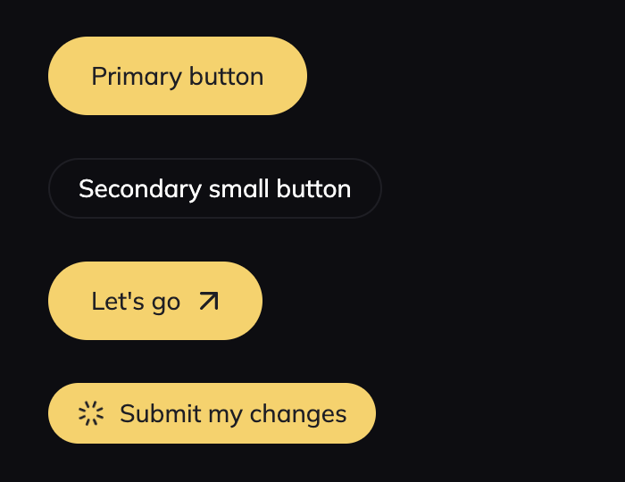

# iexec-ui-with-shadcn

We assume you have **a working React + Vite project** (with or without TypeScript)

It currently only supports dark mode.

Bear in mind that this is **work in progress**.

## Useful resources

Tailwind -> https://tailwindcss.com/docs/utility-first

Shadcn UI -> https://ui.shadcn.com/docs

Radix Primitives -> https://www.radix-ui.com/primitives/docs/overview/getting-started

## Installation

### 1- Install `shadcn/ui`

https://ui.shadcn.com/docs/installation/vite

When running the shadcn-ui `init` command, when reaching the following question:

> Where is your global CSS file?

You can answer `src/index.css`

At the end of the process you should have a `components.json` file similar to this one:

```json
{
  "$schema": "https://ui.shadcn.com/schema.json",
  "style": "default",
  "rsc": false,
  "tsx": true,
  "tailwind": {
    "config": "tailwind.config.js",
    "css": "src/index.css",
    "baseColor": "slate",
    "cssVariables": true
  },
  "aliases": {
    "components": "@/components",
    "utils": "@/utils"
  }
}
```

### 2- Copy `index.css` file

In this file we define all the design tokens related to iExec design (mainly colors).

You can replace the generated shadcn/ui `index.css` file with the one provided in this repository.

### 3- Copy `tailwind.config.js` file

In this file we use all the design tokens to extend Tailwind utility classes.

It is a starting point, you'll probably need to add more classes to fit your needs.

### 4- Install fonts

```sh
npm i @fontsource-variable/anybody \
  @fontsource/anybody \
  @fontsource/mulish \
  @fontsource/space-mono
```

Import them where you need them.

For example in `src/main.tsx`:

```javascript
import '@fontsource/mulish';
```

### 5- Icons come from 'react-feather'

```sh
npm i react-feather
```

-----

## Available components (WIP)

### Button

```tsx
import { ArrowUpRight, Loader } from 'react-feather';
import { Button } from '@/components/ui/button.tsx';

function App() {
  return (
    <>
      {/* Primary button */}
      <Button>Primary button</Button>

      {/* Secondary small button */}
      <Button variant="secondary" size="sm">
        Secondary small button
      </Button>

      {/* Button with append icon */}
      <Button>
        Let's go
        <ArrowUpRight size="20" className="-mr-1 ml-1.5" />
      </Button>

      {/* Loading button */}
      <Button size="sm">
        <Loader size="16" className="mr-2 animate-spin-slow" />
        <span>Submit my changes</span>
      </Button>
    </>
  );
}
```



### Input

🏗️ TODO

### NavBar

🏗️ TODO

### Switch

🏗️ TODO

### Toast

🏗️ TODO
